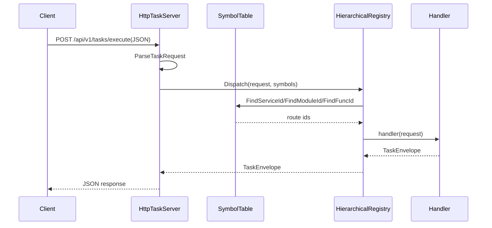

# 后端框架运行流程与扩展说明

## 1. 这套后端框架现在在做什么

这套框架的定位不是“业务实现本体”，而是一个可生成项目骨架、承载任务路由、接收 HTTP 请求、分发任务执行、并支持自动注册 handler 的后端基础设施。

它当前已经具备以下能力：

- 自动生成项目目录结构和 CMakeLists.txt
- 提供 HTTP 接口接收任务请求
- 提供同步执行与异步入队两条任务链路
- 提供 service / module / function 三层路由索引
- 提供自动注册机制，把业务 handler 从源码静态收集到注册表中
- 提供基础任务模型、内容模型和路由模型

它当前还没有完成的部分主要是：

- 真实业务 handler 的系统化填充
- `build / compile / debug / run` 这些菜单项对应的完整工程动作
- 更完善的错误处理、日志和测试体系
- 对外暴露更丰富的业务 API 和持久化能力

## 2. `main.cpp` 的运行流程

入口文件是 [backend/main.cpp](backend/main.cpp)。它现在是纯框架入口，不承载任何业务 handler。

### 2.1 启动阶段

`main.cpp` 只做一件事：调用框架运行时入口 `RunBackend(argc, argv)`。

真正的启动逻辑位于 [backend/core/app/BackendRuntime.cpp](backend/core/app/BackendRuntime.cpp)。

示例业务 handler 位于 [backend/domain/handlers/HealthPingHandler.cpp](backend/domain/handlers/HealthPingHandler.cpp)。

### 2.2 构造核心运行对象

`main()` 中依次创建了四个核心对象：

- `SymbolTable symbols`
- `HierarchicalRegistry registry`
- `BackendTaskPool taskPool`
- `HttpTaskServer httpServer(registry, symbols, taskPool)`

这四个对象分别承担：

- `SymbolTable`：把字符串路由内部化成 ID
- `HierarchicalRegistry`：按层级路由存放 handler
- `BackendTaskPool`：管理异步任务队列
- `HttpTaskServer`：对外暴露 HTTP 接口

### 2.3 启动任务池

`taskPool.Start()` 会把任务池置为可运行状态，允许后续接收任务。

### 2.4 注册所有自动注册的 handler

`backend_core::v1::RegistryBootstrap::RegisterAll(registry, symbols);` 会把所有通过 `AUTO_REGISTER` 收集到的 handler 统一注册到 `registry` 中。

这一步很关键，因为 `AUTO_REGISTER` 只是“收集”，真正变成可调度路由是在这里完成的。

### 2.5 启动 HTTP 服务

`httpServer.Start("0.0.0.0", 8080);` 之后，HTTP 服务监听 8080 端口。

当前代码中打印了两条提示：

- HTTP 服务已启动
- 可用 `POST /api/v1/tasks/execute` 调用 `template/read/get`

### 2.6 启动后台 worker 线程

`main.cpp` 还启动了一个 worker 线程：

- 线程循环等待 `taskPool.WaitAndPopTask(task)`
- 取出任务后调用 `registry.Dispatch(task.request, symbols)`
- 打印执行结果

这表示框架同时支持：

- HTTP 直接执行
- HTTP 入队，后台线程消费执行

### 2.7 退出流程

主线程通过 `std::getline(std::cin, line);` 阻塞等待输入。

当收到输入后：

- `running = false`
- `httpServer.Stop()`
- `taskPool.Stop()`
- `worker.join()`

最后退出程序。

## 3. 请求在框架里的流转路径

### 3.1 同步执行链路

如果请求走 `POST /api/v1/tasks/execute`，大致流程是：

1. HTTP Server 接收 JSON 请求
2. 解析出 `serviceName`、`moduleName`、`funcName`
3. 通过 `SymbolTable` 找到对应 ID
4. 通过 `HierarchicalRegistry` 找到 handler
5. 执行 handler
6. 返回 `TaskEnvelope` 的 JSON 结果

### 3.2 异步入队链路

如果请求走 `POST /api/v1/tasks/submit`，流程是：

1. HTTP Server 接收 JSON 请求
2. 解析出任务内容
3. 封装成 `BackendTask`
4. 放入 `BackendTaskPool`
5. 后台 worker 线程从队列取出任务
6. 通过 `registry.Dispatch` 执行
7. 打印执行结果

### 3.3 健康检查链路

`GET /api/v1/health` 直接返回固定 JSON：

- `success: true`
- `message: ok`

这是框架最基础的可用性检查接口。

## 4. 核心模块完成情况

### 4.1 已完成的部分

#### 4.1.1 路由与调度骨架

[backend/core/route/SymbolTable.h](backend/core/route/SymbolTable.h) 和 [backend/core/route/SymbolTable.cpp](backend/core/route/SymbolTable.cpp) 已经提供了：

- service / module / function 的符号表
- 路由 ID 的内部化
- 反查接口

[backend/core/registrar/HierarchicalRegistry.h](backend/core/registrar/HierarchicalRegistry.h) 和 [backend/core/registrar/HierarchicalRegistry.cpp](backend/core/registrar/HierarchicalRegistry.cpp) 已经提供了：

- 路由注册
- 按名称注册
- 路由分发
- 未命中时的失败 envelope

#### 4.1.2 自动注册机制

[backend/core/registrar/AutoRegistrar.h](backend/core/registrar/AutoRegistrar.h) 和 [backend/core/registrar/AutoRegistrar.cpp](backend/core/registrar/AutoRegistrar.cpp) 已经提供了：

- `AUTO_REGISTER` 宏
- 自动注册收集器
- 启动时统一注册入口

这意味着你只要在任意业务 cpp 里写：

```cpp
AUTO_REGISTER("template", "read", "get", HandleReadTemplateEntry);
```

就能把 handler 收集起来，再由 `RegistryBootstrap::RegisterAll` 在启动时统一装配。

#### 4.1.3 任务模型

[backend/core/task_manager/TaskModel.h](backend/core/task_manager/TaskModel.h) 已经定义了：

- `ContentItem`
- `TaskRequest`
- `TaskEnvelope`

这为 HTTP 输入输出和内部调度提供了统一数据结构。

#### 4.1.4 任务池

[backend/core/task_manager/BackendTaskPool.h](backend/core/task_manager/BackendTaskPool.h) 和 [backend/core/task_manager/BackendTaskPool.cpp](backend/core/task_manager/BackendTaskPool.cpp) 已经提供了：

- 启动 / 停止控制
- 阻塞式入队
- 阻塞式出队
- 条件变量唤醒

这是异步任务链路的基础。

#### 4.1.5 HTTP 服务壳

[backend/core/transport/HttpTaskServer.h](backend/core/transport/HttpTaskServer.h) 和 [backend/core/transport/HttpTaskServer.cpp](backend/core/transport/HttpTaskServer.cpp) 已经提供了：

- `/api/v1/health`
- `/api/v1/tasks/execute`
- `/api/v1/tasks/submit`
- JSON 解析和 envelope 输出
- 与注册表和任务池的连接

#### 4.1.6 工程生成脚本

`scripts/` 目录下的 Lua 生成脚本已经可以：

- 初始化目录结构
- 生成根目录 CMakeLists.txt
- 生成 core / domain 的 CMakeLists.txt
- 生成第三方配置文件
- 复制 core 模板代码

也就是说，框架的“项目生成器”这一层已经基本成型。

### 4.2 还没有完成的部分

#### 4.2.1 业务模块仍然是骨架

目前业务目录里只有一个示例 handler：

- `system/health/ping`

这说明“路由机制”完成了，但“具体业务内容”还没系统填充。

#### 4.2.2 `run` / `debug` / `build` 菜单还没真正做完

Lua 菜单里已经预留了这几个入口，但其中不少函数仍然只是占位或半成品。

#### 4.2.3 工程化细节还需要收尾

还包括：

- 路径与命令拼接的健壮性
- Windows / Linux 下命令兼容性
- 错误提示统一化
- 构建缓存清理和重建策略
- 自动化测试

## 5. 如何在这个框架上填充具体内容

### 5.1 新增一个业务接口的标准做法

如果你要新增一个业务功能，建议按下面步骤做：

1. 在 [backend/domain/handlers](backend/domain/handlers) 新建一个 `.cpp`（可从模板复制）
2. include [backend/core/api/BackendDev.h](backend/core/api/BackendDev.h)
3. 定义 handler 函数并用 `AUTO_REGISTER` 注册路由
4. 构建后直接从 HTTP 接口调用该路由
5. 如有需要，再把它接到异步任务队列里

### 5.2 业务接入规则文档

业务 handler 的完整开发规范、读写模板说明、复制替换步骤、桥接函数解释，统一维护在：

- [docs/backend_business_handler_rules.md](docs/backend_business_handler_rules.md)

总览文档只保留架构和联调信息，避免两份文档重复维护。

## 6. 这份代码当前需要注意的几个点

### 6.1 入口与模板现状

当前 `main.cpp` 已是纯框架入口，业务逻辑不应再写在入口文件中。

现在已具备：

- 运行时统一入口（含 `--smoke-test`）
- 读模板路由：`template/read/get`
- 写模板路由：`template/write/upsert`

当前最小可运行测试输出：

```text
smoke_test success=1 message=read_template_ok
```

### 6.2 构建脚本和 CMake 需要清理旧缓存

如果你之前换过项目路径，`FetchContent` 的子构建缓存可能会带着旧绝对路径，需要清理 `third_party/*-subbuild` 目录后重配。

### 6.3 `build` / `compile` 命令需要注意路径引号

当前脚本里有一些命令拼接直接拼路径的情况，如果项目目录带空格，会出问题。

### 6.4 给开发者的模板入口

为了让新同学不用关心 `main.cpp`，项目已经提供：

- 统一开发头文件: [backend/core/api/BackendDev.h](backend/core/api/BackendDev.h)
- handler 模板: [backend/domain/handlers/HandlerTemplate.cpp.example](backend/domain/handlers/HandlerTemplate.cpp.example)

建议开发者直接复制模板为新的 `.cpp` 文件并修改路由与逻辑。

## 7. 总结

一句话概括：

这套后端框架的“运行骨架”已经完成，已经能启动 HTTP 服务、注册路由、接收任务、分发任务、并生成项目工程文件；但“具体业务层”和“工程化收尾”还需要继续填充。

如果你下一步要真正让它可用，最值得优先补的顺序是：

1. 继续补真实业务 handler，而不是只保留 `system/health/ping`
2. 把新业务 handler 接入 `AUTO_REGISTER`
3. 补全 build / compile / debug 的菜单动作
4. 加一组最小可运行测试

## 8. 接口调用示例

下面给出当前框架最常用的三个接口示例，便于联调。

### 8.1 健康检查

```bash
curl -X GET http://127.0.0.1:8080/api/v1/health
```

预期响应：

```json
{"success":true,"message":"ok"}
```

### 8.2 同步执行任务

```bash
curl -X POST http://127.0.0.1:8080/api/v1/tasks/execute \
	-H "Content-Type: application/json" \
	-d '{
		"taskId": "demo_sync_001",
		"serviceName": "template",
		"moduleName": "read",
		"funcName": "get"
	}'
```

预期响应关键字段：

- `success` 为 `true`
- `message` 为 `read_template_ok`
- `route` 回显为 `template/read/get`

### 8.3 异步提交任务

```bash
curl -X POST http://127.0.0.1:8080/api/v1/tasks/submit \
	-H "Content-Type: application/json" \
	-d '{
		"taskId": "demo_async_001",
		"serviceName": "template",
		"moduleName": "write",
		"funcName": "upsert"
	}'
```

预期响应关键字段：

- `accepted` 为 `true`
- `message` 为 `accepted`

随后可在服务日志中看到 worker 线程打印的任务执行结果。

## 9. 一次完整请求的时序图

以 `POST /api/v1/tasks/execute` 为例：



## 10. 最小联调步骤

建议按这个顺序做最小联调：

1. 构建项目，确认可执行文件产出。
2. 运行 `backend.exe --smoke-test`，确认输出 `smoke_test success=1 message=read_template_ok`。
3. 正常启动服务 `backend.exe`。
4. 调用 `GET /api/v1/health` 验证服务在线。
5. 调用 `POST /api/v1/tasks/execute` 验证同步链路。
6. 调用 `POST /api/v1/tasks/submit` 验证异步入队链路。

如果第 5 步成功但第 6 步失败，优先检查 `BackendTaskPool::Start()` 是否在启动流程里被调用。

## 11. 业务规则文档入口

业务规则与模板细节请统一阅读：

- [docs/backend_business_handler_rules.md](docs/backend_business_handler_rules.md)

该文档包含：

1. 读/写两类模板逐步讲解
2. `HandleWriteTemplateEntry` / `HandleReadTemplateEntry` 的作用说明
3. 复制粘贴替换时的必改项与禁止改项
4. 最小完备基础函数操作的设计清单
